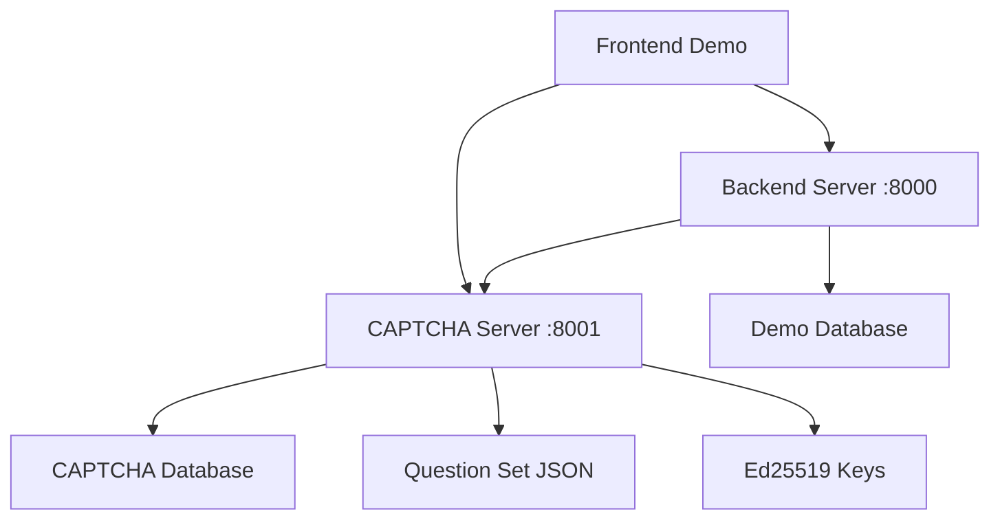

# Python Code Challenge CAPTCHA System

A sophisticated CAPTCHA system that challenges users with Python programming problems instead of traditional image-based puzzles. Built for the Python Discord Code Jam 12 by team **Peppy Poppies**.

## 🌟 Features

### 🧠 Intelligent Python Challenges
- **Dynamic Question Generation**: Over 100+ unique mathematical and algorithmic challenges
- **Adaptive Difficulty**: Questions range from basic arithmetic to complex mathematical operations
- **Real-time Code Execution**: Users write Python functions that are executed safely in a sandboxed environment
- **Mathematical Operations**: Includes prime numbers, Fibonacci sequences, bitwise operations, and more

### 🔐 Robust Security Architecture
- **JWT-based Authentication**: Secure token-based verification system
- **Ed25519 Cryptography**: Modern elliptic curve cryptography for token signing
- **Sandboxed Execution**: Safe Python code execution with restricted globals
- **Session Management**: Secure challenge-response flow with expiration handling

### 🎨 Modern User Interface
- **Responsive Design**: Mobile-friendly interface with modern CSS
- **Interactive Code Editor**: Syntax-highlighted Python editor with Monaco/Ace integration
- **Real-time Feedback**: Live progress indicators and error reporting
- **PyScript Integration**: Client-side Python execution using PyScript/Pyodide

### 🏗️ Microservices Architecture
- **Captcha Server**: Dedicated service for challenge generation and validation
- **Backend Server**: Main application server with authentication and user management
- **Frontend**: Modern web interface with PyScript-powered code execution
- **Database Integration**: SQLite with Advanced Alchemy ORM

### 🐳 Deployment Ready
- **Docker Support**: Complete containerization with docker-compose
- **Development Mode**: Hot-reload support for rapid development
- **Production Ready**: Configurable for production deployment
- **Health Checks**: Built-in health monitoring for services

## 🚀 Quick Start

### Prerequisites
- Python 3.12+
- [uv](https://docs.astral.sh/uv/getting-started/installation/) package manager
- Docker (optional, for containerized deployment)

### 1. Environment Setup

Clone the repository and set up your environment:

```bash
# Create .env file from template
cp .env.example .env

# Edit .env file with your configuration
# Required: GEMINI_API_KEY (for advanced features)
# Optional: Customize ports and paths
```

### 2. Install Dependencies

```bash
# Install all dependencies including dev, frontend, backend, and math groups
uv sync

# Activate virtual environment
# Windows
.venv\Scripts\activate

# Linux/macOS
source .venv/bin/activate
```

### 3. Build the Project

```bash
# Build frontend assets and configure domains(This needs to be done evrytime you change something)
uv run python build.py
```

## 🖥️ Running the Application

### Option A: Development Mode (Recommended)

Run both services in separate terminals:

```bash
# Terminal 1: Start CAPTCHA server(This must be done first)
litestar --app server.captcha.main:app run --port 8001 --reload

# Terminal 2: Start main backend server
litestar --app server.backend.main:app run --port 8000 --reload
```

Access the application at: http://localhost:8000

### Option B: Docker Deployment

```bash
# Start all services with docker-compose
docker compose up -d --build
```

Access the application at:
- Main app: http://localhost:9200
- CAPTCHA service: http://localhost:9201

## 🧪 Testing the System

### Demo Credentials
```
Username: codejam12
Password: py-discord
```

### Sample Challenge Flow
1. Visit the login page
2. Enter the demo credentials
3. Solve the Python programming challenge
4. Submit your solution to complete authentication

## 📚 API Documentation

### CAPTCHA Service (Port 8001)
- **OpenAPI Docs**: http://localhost:8001/api/schema
- **Generate Challenge**: `POST /api/challenge/generate-challenge`
- **Get Challenge**: `GET /api/challenge/get-challenge/{challenge_id}`
- **Submit Solution**: `POST /api/challenge/submit-challenge`
- **Public Key**: `GET /api/challenge/get-public-key`

### Backend Service (Port 8000)
- **OpenAPI Docs**: http://localhost:8000/api/schema
- **Login**: `POST /api/auth/login`
- **Logout**: `POST /api/auth/logout`
- **User Info**: `GET /api/auth/me`
- **Get Challenge**: `GET /api/auth/get-challenge`

## 🔧 Configuration

### Environment Variables

| Variable | Description | Default | Changes Required |
|----------|-------------|---------|----------|
| `GEMINI_API_KEY` | Google Gemini API key for advanced features | - | No |
| `SECRET_KEY` | JWT secret for demo server | `super-secret-key` | Yes |
| `KEY_PATH` | Path to Ed25519 key files | `./captcha_data` | No |
| `CODECAPTCHA_DOMAIN` | CAPTCHA server external URL | `http://127.0.0.1:8001` | No |
| `CODECAPTCHA_DOMAIN_INTERNAL` | CAPTCHA server internal URL (Docker) | - | No |
| `FONT_PATH` | Path to font file for image generation | `./captcha_data/JetBrainsMono-Regular.ttf` | No |

### Key Files
- **Ed25519 Keys**: Auto-generated in `captcha_data/` directory
  - `public.pem`: Public key for JWT verification
  - `private.pem`: Private key for JWT signing
- **Question Set**: `captcha_data/question_set.json` - Challenge definitions
- **Font**: `captcha_data/JetBrainsMono-Regular.ttf` - OFL licensed font

## 🧮 Challenge Types

The system generates diverse Python programming challenges:

### Mathematical Operations
- **Basic Arithmetic**: Addition, subtraction, multiplication, division
- **Exponentiation**: Squares, cubes, and custom powers
- **Modular Arithmetic**: Modulo operations with various bases

### Advanced Mathematics
- **Prime Numbers**: nth prime, prime checking, prime arithmetic
- **Fibonacci Sequence**: Calculate Fibonacci numbers
- **Factorials**: Compute factorials and related operations
- **Number Theory**: Sum of natural numbers, divisors

### Bitwise Operations
- **XOR Operations**: Bitwise exclusive OR with constants
- **AND Operations**: Bitwise AND with multiplication
- **Bit Manipulation**: Complex bitwise arithmetic

### Algorithmic Challenges
- **Sequence Generation**: Generate mathematical sequences
- **Pattern Recognition**: Identify and continue patterns
- **Conditional Logic**: Multi-step conditional operations

### Example Challenges
```python
# Example 1: Basic arithmetic
"add 25 squared to x"
# Solution: lambda x: x + 25**2

# Example 2: Prime numbers
"x plus the 100-th prime number"
# Solution: lambda x: x + prime(100)

# Example 3: Bitwise operations
"bitwise XOR x with 1337 then add 42"
# Solution: lambda x: (x ^ 1337) + 42
```

## 🏗️ Architecture

### System Components



### Technology Stack

#### Backend
- **Framework**: Litestar (FastAPI-compatible)
- **Database**: SQLite with Advanced Alchemy ORM
- **Authentication**: JWT with Ed25519 signatures
- **Cryptography**: Python `cryptography` library
- **Image Generation**: Pillow (PIL)

#### Frontend
- **Core**: HTML5, CSS3, Modern JavaScript
- **Python Integration**: PyScript + Pyodide
- **Code Editor**: Monaco Editor / Ace Editor
- **UI Framework**: Custom CSS with modern design patterns
- **Visualization**: Panel + Bokeh for interactive components

#### DevOps
- **Package Management**: uv (modern Python package manager)
- **Containerization**: Docker + Docker Compose
- **Code Quality**: Ruff linter with comprehensive rules
- **Development**: Hot-reload support for rapid iteration

## 🔒 Security Features

### Cryptographic Security
- **Ed25519 Signatures**: Modern elliptic curve cryptography
- **JWT Tokens**: Secure, stateless authentication
- **Key Rotation**: Support for key pair regeneration
- **Expiration Handling**: Time-limited challenge validity

### Code Execution Safety
- **Sandboxed Environment**: Restricted Python execution context
- **Limited Globals**: Only safe built-in functions available
- **Timeout Protection**: Execution time limits
- **Memory Limits**: Controlled resource usage

### Input Validation
- **Schema Validation**: msgspec-based request/response validation
- **SQL Injection Protection**: ORM-based database access
- **XSS Prevention**: Proper output encoding
- **CORS Configuration**: Controlled cross-origin requests

## 🧪 Development

### Project Structure
```
├── server/
│   ├── backend/          # Main application server
│   │   ├── controller/   # API endpoints
│   │   ├── lib/         # Configuration and utilities
│   │   └── models.py    # Database models
│   └── captcha/         # CAPTCHA service
│       ├── controller/  # Challenge API endpoints
│       ├── lib/         # Services and utilities
│       ├── models.py    # Challenge database models
│       └── schema/      # Request/response schemas
├── frontend/
│   ├── demo/           # Main demo application
│   └── captcha/        # CAPTCHA interface
├── crypto/             # Cryptographic utilities
├── captcha_data/       # CAPTCHA assets and data
└── demo_data/          # Demo application data
```

### Dependency Groups
- **dev**: Development tools (ruff, pre-commit)
- **frontend**: PyScript, Panel, Pyodide
- **backend**: Litestar, cryptography, database tools
- **math**: NumPy, SymPy for mathematical operations

### Code Quality
- **Linting**: Ruff with comprehensive rule set
- **Type Checking**: Python 3.12+ type hints
- **Pre-commit Hooks**: Automated code quality checks
- **Documentation**: Comprehensive docstrings

## 🚀 Deployment

### Production Considerations
1. **Environment Variables**: Set secure values for production
2. **Database**: Consider PostgreSQL for production workloads
3. **Reverse Proxy**: Use nginx or similar for SSL termination
4. **Monitoring**: Implement logging and health checks
5. **Scaling**: Consider horizontal scaling for high traffic

### Docker Production Setup
```bash
# Production docker-compose with environment overrides
docker compose -f docker-compose.yml -f docker-compose.prod.yml up -d
```

## 🤝 Contributing

### Team Peppy Poppies
- **Harshal6927**
- **i-am-unknown-81514525**
- **Ununennium817**
- **tayvona**
- **fiwam**
- **dragonsenseiguy**

## 📄 License

This project is part of Python Discord Code Jam 12. The included JetBrains Mono font is licensed under the Open Font License (OFL), which is compatible with the MIT license.

## 🆘 Troubleshooting

### Common Issues

**Port Already in Use**
```bash
# Check what's using the port
lsof -i :8000
lsof -i :8001

# Kill the process or use different ports
```

**PyScript Loading Issues**
- Ensure stable internet connection for CDN resources
- Check browser console for JavaScript errors
- Verify PyScript/Pyodide compatibility

**Database Issues**
```bash
# Reset databases
rm captcha_data/captcha.sqlite demo_data/backend.sqlite

# Restart services to recreate databases
```

**Key Generation Problems**
```bash
# Manually regenerate Ed25519 keys
rm captcha_data/private.pem captcha_data/public.pem

# Restart CAPTCHA server to regenerate keys
```

### Getting Help
- Check the OpenAPI documentation at `/api/schema` endpoints
- Review application logs for detailed error messages
- Ensure all environment variables are properly configured

---

**Built with ❤️ for Python Discord Code Jam 12**
