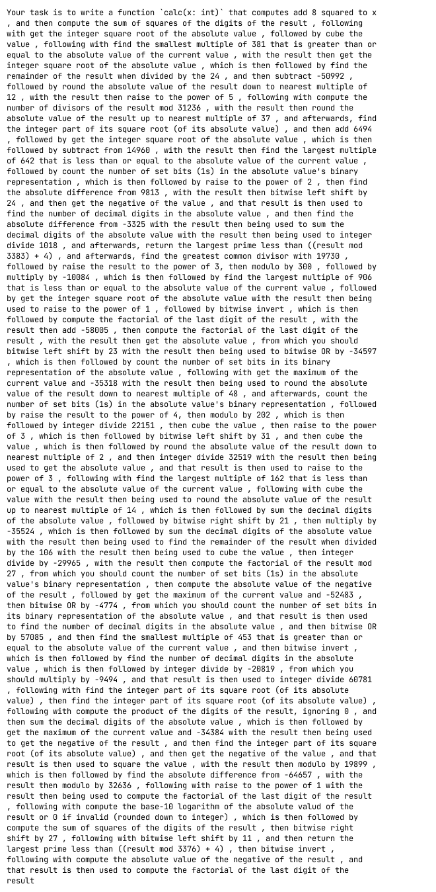

# CodeCaptcha
A CAPTCHA system where the user writes python code to solve a given question.

A normal example:


<details>
<summary>Chaotic example (Note that it is very long):</summary>

This question has 100 steps and ~~AI has failed to solve this :)~~ (I used the wrong model in the original test with Google Gemini 2.5 Flash, and Gemini 2.5 Pro was able to solve this with 13,857 tokens)



<details>
<summary>Spoiler: Test input</summary>

```py
[16386, 19874, 48296, 41718, 58488, 42810, 58044]
```

</details>

<details>
<summary>Spoiler: Test output</summary>

```py
[24, 24, 24, 24, 24, 24, 24]
```

Could you have possibly guessed the result looks like this? I certainly didn't

> Side note: The reason I figured out afterward is that each step in the question is deterministic (a given input would always give the same output for the same step), and many steps in the `question_set.json` have a many-to-one relationship, therefore, when there are a lot of steps (in this case: 100), it is very likely that all the inputs produce the exact same result.

</details>

</details>

## How to Run the project with the demo
<details>
<summary>Run with docker (recommended)</summary>

Prerequisites: Have [docker](https://docs.docker.com/engine/install/) installed with `docker compose`

### Step 1: Setup `.env`

In contrast to running without docker, `.env` setup is necessary for running in docker, It would fail if the following environment variables are not set.

- `CODECAPTCHA_DOMAIN` to `http://127.0.0.1:9201`
    - It can be changed depending on the configuration in `docker-compose.yml`. This environment variable is the domain in which the **client** accesses the CAPTCHA server
- `CODECAPTCHA_DOMAIN_INTERNAL` to `http://captcha:8001`
    - If the CAPTCHA endpoint is from `CODECAPTCHA_DOMAIN` it can be accessible inside the docker container (such as a publicly accessible domain), then this environment variable is not needed

Other configurations can be changed, according to the documentation in `.env.example`. The default values should work for them.

### Step 2: Run the project
```bash
docker compose up -d --build
```
The [demo site](http://127.0.0.1:9200) and the [captcha site](http://127.0.0.1:9201) can be accessed from http://127.0.0.1:9200 and http://127.0.0.1:9201 respectively
</details>
<details>
<summary>Run without docker</summary>

Prerequisites: Have [uv](https://docs.astral.sh/uv/getting-started/installation/) and `python3.12` installed

### Step 1: Setup `.venv`
```bash
uv sync
```

### Step 2: Setup `.env`
By default, the project can be run without creating or setting up `.env`, however, you might want to change some configurations. Check `.env.example` for information to configurate `.env`.

Note: If you changed the `.env` file, or any other files in `frontend/`, you must set the project up from the next step again.

### Step 3: Run the build script
```bash
uv run build.py
```
This configures the frontend code to create a set of files in `dist/` which link the demo assets to the CAPTCHA server endpoint defined in `CODECAPTCHA_DOMAIN`

### Step 4: Run the project
Run in 2 seperate terminals
```bash
# This must be run first
uv run litestar --app server.captcha.main:app run --port 8001 --reload
# Run the following about 5 to 10 seconds later in the other terminal
uv run litestar --app server.backend.main:app run --port 8000 --reload
```
`--host 0.0.0.0` can be added on either command if it need to be accessible from other IP

The [demo site](http://127.0.0.1:8000) and the [captcha site](http://127.0.0.1:8001) can be accessed from http://127.0.0.1:8000 and http://127.0.0.1:8001 respectively
</details>

## Short video demo


## Why is it wrong?

Have you ever seen a meme like this?


> Mark Rushakoff Sep 19, 2009 from StackOverflow, Answer to "alternative captcha methods", https://stackoverflow.com/a/1448684 CC-BY-SA 2.5. The original source that the author mentioned is no longer available

One that is overcomplicated and no one can solve them? We done something similar, but for coding! You have to write the code to solve very specific problems that have no practical usage, and hopefully it's fun?

### Other reasons it is wrong
- It is written in python - which makes it really slow (This is why it takes 5-6 seconds to load) and in addition to the complex UI framework used on the CAPTCHA UI for features such as the code editor, it would freeze my tab for about 10s and about 30s to load (hopefully that doesn't happen on yours), and it downloads about 50MiB of packages before it can be run.
- Statistically LLMs have higher success rates to solve these problems than a human can, without help from LLMs or other people (considering most of the population in the world cannot write python code by themselves).
- LLMs are not trained to avoid solving the question, unlike conventional CAPTCHAs, which makes them potentially have a higher chance of success than normal CAPTCHAs.
- The server also needed high computational effort to know and validate the answer, unlike normal CAPTCHA which the question is generated from answers.

## Project structure

- `server/captcha` - The CAPTCHA server, written with Litestar that is responsible for generating images and creating the questions.
- `server/backend` - A basic demo server written with Litestar that handles the theoretical login system that is gated with CAPTCHA.
- `frontend/captcha` - Contains the static assets for the CAPTCHA server.
  <details>
    <summary>Disclosure</summary>

    `frontend/captcha/parse.py` is a patch for micropython as it didn't bundle the `urllib.parse` stdlib. The file contains `urllib.parse` and `ipaddress` standard libraries from [cpython](https://github.com/python/cpython) and a patch for some other feature that isn't available in micropython such as `str.isascii` and "too complex" regex which is used by the original code from the standard library, which replaces with equivialent behaviour.

  </details>
- `frontend/demo` - A demo login page for testing
- `crypto` - A module that both CAPTCHA server and demo server use to generate/handle public private key pair, and to generate and validate the JWT(JSON Web Token) using the Ed25519 key.
- `captcha_data` - Contains a font file and the a question set
  <details>
    <summary>Disclosure</summary>

    - `captcha_data/JetBrainsMono-Regular.ttf` is a font created by JetBrains, and licensed under SIL Open Font License, Version 1.1 (OFL). The license text is inclued in `captcha_data/OFL.txt` as required by the license. The font is included for the purpose to run the project with minimal setup, and any other font can be used. The OFL license is compatible with MIT license according to [FOSSA](https://fossa.com/blog/open-source-licenses-101-sil-open-font-license-ofl/)
    - `captcha_data/question_set.json` is created with a combination of manual effort and AI generation. Approximately 2 million
questions are generated during testing, with only 1 exceeding the execution timeout of 0.5s during testing when calculating a prime number, which likely originates from saturated resource usage from other tasks running on the test device. However, some question descriptions might not match the checking criteria (with 1 known case found after the deadline)

  </details>
- `build.py` A build script which put all the files from `frontend/` to `dist/` and replaces `[domain]` in specific file to domain defined by environment variable `CODECAPTCHA_DOMAIN` so the client can connect to the correct CAPTCHA servers given from the static file. This is only needed for the demo server, but for consistency, the CAPTCHA server will also use it.

## Contribution list
<details>
    <summary>harshal6927 (@Harshal6927)</summary>

- Demo server
- CAPTCHA server
- Demo page UI
- Demo login system on the backend
- Setup SQLite database for the servers
</details>
<details>
    <summary>deleted.user0 (@i-am-unknown-81514525)</summary>

- CAPTCHA UI
- CAPTCHA frontend
- Adding login system on the demo frontend
- JWT generation and validation, Ed25519 key generation and handling
- Question generator parser
- Writing question set
- Update image generation
- Write the final `README.md`
</details>
<details>
    <summary>ununenium817 (@Ununenium817)</summary>

- Help writing the CAPTCHA server that was replaced
- Writing question set
- Construct system prompt and code to generate part of question set
</details>
<details>
    <summary>wrybyte (@tayvona)</summary>

- Minor UI improvement on demo page
</details>
<details>
    <summary>fiwam (@fiwam)</summary>

- Update CAPTCHA frontend to handle image
- Convert the question generated to send image instead of text to client
</details>
<details>
    <summary>dragonsenseiguy (@DragonSenseiGuy)</summary>

- Attempt to write the CAPTCHA server that was replaced
- Minor UI improvement for the CAPTCHA frame for usability
- Wrote JWT Validator but was scrapped(due to issues).
- Attempt to write the login system for demo server that didn't get merged.
- Update various part of `README.md`
</details>

## Framework choice

The project used a combination of Pyscript and Pyodide from the approved frameworks, with some HTML/js/css when necessary in the CAPTCHA files.
- Pyscript is used in `frontend/captcha/captcha.py` and `frontend/captcha/captcha_handler.py` to handle the communication between 2 sites to exchange the JWT token.
- Pyodide is used to run user code in isolation in `frontend/captcha/runner.js`

Other framework:
- [Panel](https://panel.holoviz.org/) is used as a frontend framework with pyscript as a CAPTCHA UI, defined in `frontend/captcha/captcha.py`.
- [Litestar](https://litestar.dev/) is used as backend framework for both the CAPTCHA server and DEMO server in `server/`.
- [pyjwt](https://pyjwt.readthedocs.io/) and [cryptography](https://cryptography.io/) is used for Ed25519 key handling, JWT creation and validation in `crypto/`.
- [Pillow](https://pillow.readthedocs.io/en/stable/) is used to generate image of question that is sent to the client.
